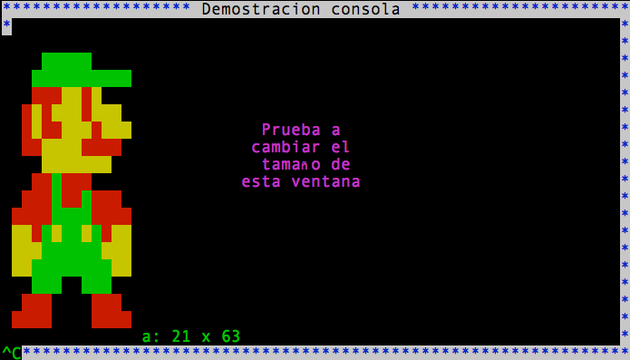

Better Console
==============

This simple library has been done for my first-year students at [Universitat Politècnica de Catalunya](http://www.upc.cat).
It adds to the Linux and Mac console the next functionalities:

* Specify foreground and background color for the printed text
* Clear screen
* Specify coordinates in the screen to print to.
* Retrieve console screen size (rows and columns)
* Empty the keyboard buffer
* Set console type echo on/off
* Show/hide console cursor
* Non-blocking read of the standard input (keyboard)

Please have a look to the betterconsole.h in-comments documentation for more documentation about the library.

It includes some utilization examples.

To compile the library as well as the examples:

gcc betterconsole.c examples.c -o examples
